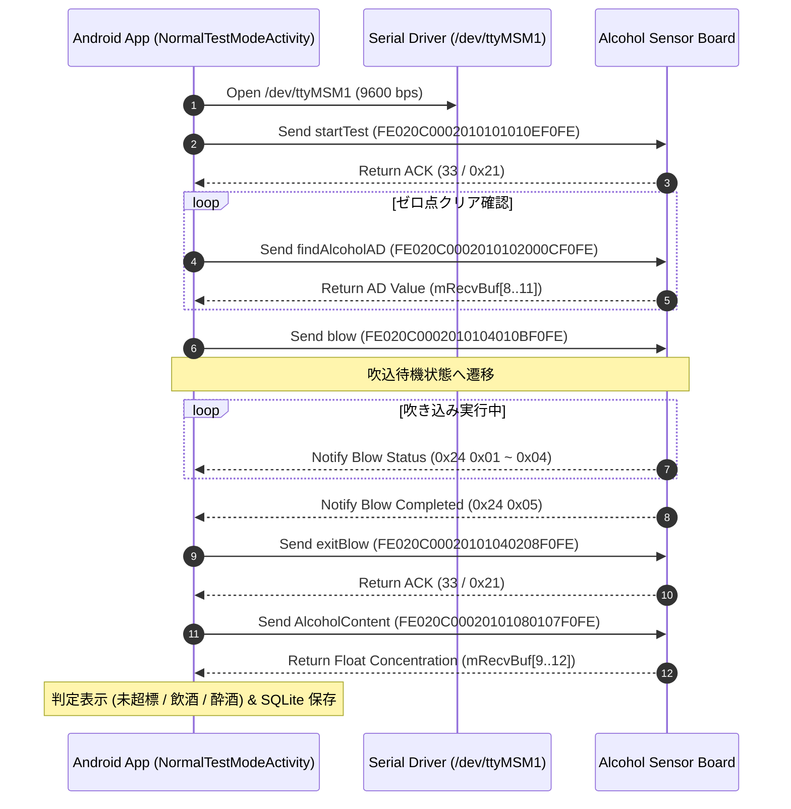

# 実際の測定コマンドの動作 (Measurement Behavior & Advanced Analysis)

本ドキュメントでは、`serial_protocol.md` で定義されたコマンド群が、**実際の測定時にどのような非同期挙動やレイテンシを示すか**、およびデバイスの状態遷移に関する実機検証（生TCPブリッジ経由でのパケット解析・アルコール蒸気テスト）の結果をまとめています。

---

## 1. 通常測定シーケンスフロー

アルコール検知におけるメインアプリケーションとセンサー基板間の標準的な交互作用シーケンス図です。

---

## 2. 実証された濃度取得の非同期プロトコル

濃度を取得するコマンド（`AlcoholContent` / `passiveTest`）は、**単一の要求に対する即座の応答フレームで確定値が返るとは限りません。**

### 2.1 非同期待機ロジック (`flag` バイト)
これらのコマンドのレスポンス（`0x23` Data Packet）の第8バイト（`mRecvBuf[8]`）は **`flag`** として機能します。

* `flag == 0`: 「現在気体を分析中」を意味する暫定応答。確定値ではないため、**同じリクエストへの応答をさらに待ち続ける**必要があります。（リトライ送信は不要）
* `flag == 1, 2, 3`: **確定値**。第9〜12バイトの Float 値を最終的な濃度結果として採用します。

### 2.2 応答レイテンシの実測値
分析にかかる時間は、センサー内部の残留アルコール濃度（≒AD値）に比例して顕著に伸びます。

| 状態 | 確定応答までのレイテンシ |
|---|---|
| 素面ベースライン | 1.3〜3.9秒 |
| 濃度ピーク時 (18.23 mg/L相当) | 最大 **22〜24秒** |
| 減衰中 (3.11 → 0.09) | 23秒 → 13秒 と単調減少 |

> [!WARNING]
> 独自のクライアントを実装する場合、10秒程度の固定タイムアウトでは高濃度時に**確実にタイムアウトして失敗します**。タイムアウトは**30秒以上**の余裕を持たせる必要があります。

---

## 3. パッシブ（受動）テストと AD値ノイズ

「受動測定（被动测试）」モードは、対象者がマウスピースに息を吹き込むのではなく、機器が周囲の空気を吸引して検知するモードです。

### 3.1 測定サイクル
`passiveTest` コマンドを送信すると、確定応答（`flag=1,2,3`）が返るまで分析が継続されます。アプリ側では確定後に `findAlcoholAD` でベースラインを再確認し、再び `passiveTest` ループに入ることで常時監視（Passive Monitor）を実現できます。

### 3.2 サイクル境界のノイズ問題
実機テストにおいて、`passiveTest` の測定サイクルが切り替わる瞬間（前回確定応答が届き、次回を送信する直後）に、`findAlcoholAD` で取得できる生のAD値が一時的に急上昇するノイズ現象が確認されました。

* **仮説**: `passiveTest` の測定サイクル切り替え時に内部の**ソレノイドバルブ等が物理的に動作**し、その振動や気流変化がセンサーの生値に過渡的なノイズとして乗っていると考えられます。
* **注意点**: AD値の短期的なスパイクを実際のアルコール蒸気濃度変化と解釈する際は、それが `passiveTest` の切り替えタイミングと重なっていないか警戒する必要があります。

---

## 4. デバイス状態遷移とコマンド受付可否

通常測定時、センサー基板は内部で状態（State）を遷移させています。

1. **IDLE**: 待機状態。全26種類のコマンドを高速（50〜150ms）に処理可能。
2. **ZEROING**: `findAlcoholAD` をループ送信しゼロクリアを待つ状態。
3. **WAIT_BLOW / BLOWING**: `blow` 送信後、吹き込みを待っている状態。
   * **並行コマンドの危険性**: この状態で `findAlcoholAD` や `MPa` 以外のコマンド（`AlcoholContent` 等）を高頻度（例: 0.4秒間隔）で並行送信すると、**デバイスが完全に応答不能になる（フリーズする）**ことが確認されています。ポーリングは 1.5秒以上の間隔を開け、最低限のコマンドに留めるのが安全です。
4. **ANALYZING**: 息を吹き終え、`AlcoholContent` の確定応答を待っている状態。

---

## 5. TCPブリッジアプリにおけるトラフィック混入問題

我々が開発したデバッガーアプリ内部では、TCPソケットでの通信中継（TCPブリッジ）を行っています。しかし、アプリ内部で「センサー自動ポーリング」や「標準測定シーケンス」が裏で動いていると、**それらが送信したコマンドの応答フレームが、TCPクライアント向けのストリームに混入してしまう問題**が発生しました。

* **対策**: TCPクライアントが接続した際は、アプリ内部からの自動ポーリング等を一時停止させるよう排他制御（Mutex）を実装しました。これにより、外部からのコマンド送信と応答がクリーンに一対一で対応するようになります。

---

## 6. AD値と濃度の非線形性・単位仕様

### 6.1 単位仕様
プロトコルから取得できるFloat値の単位は **`mg/L(BrAC)`（呼気中アルコール濃度）** です。
公式アプリ側で「血中濃度（BAC）」等として表示する場合は、この値に `220.0` 等の定数を乗算して画面表示しています。

### 6.2 AD値との非線形性と活用方法
アルコール蒸気テストによる生データの比較（AD値 vs 濃度）から、両者は完全に比例するわけではないことが判明しました。

| 状態 | Concentration (濃度) / AD 比 |
|---|---|
| ベースライン | ≈ 5.1 × 10⁻⁶ |
| ピーク時 | ≈ 2.85 × 10⁻⁴ |

比率がベースラインとピークで約56倍も変動するため、生のAD値を**単純な線形係数で濃度に一発変換することはできません**。正確な確定値が必要な場合は、必ず `AlcoholContent` などの正式なコマンドでデバイス内のアルゴリズムを通した濃度値を取得してください。

**AD値の活用ポテンシャル:**
完全な線形性はないものの、AD値の変動カーブ自体は濃度カーブの推移と非常によく一致します。そのため、以下のような用途であれば十分に活用できる余地があります。
1. **リアルタイムの目安表示**: `passiveTest` の数十秒の待機中に、現在アルコールを検知して数値が跳ね上がっている最中なのか、下がり始めているのかを示すUI上のプログレス（非確定の相対指標）としての利用。
2. **高速・非ブロッキングな状態監視**: `AlcoholContent` が分析中で数十秒ブロックされるのに対し、`findAlcoholAD` は**どのStateであっても 50〜150ms という短時間で即座に返答が来る**ため、UIスレッドを詰まらせずに現在のセンサー状況を監視するのに極めて適しています。
3. **独自の高度な補正**: 複数点の基準ガスを用いた非線形キャリブレーションカーブ（曲線近似）を自力で実装する場合の生データとしての利用。
