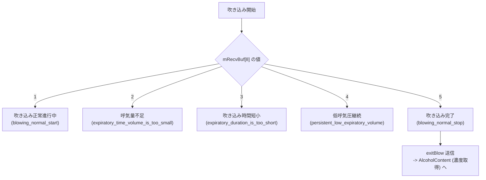

# シリアル通信プロトコル

本ドキュメントでは、アルコール検知端末のメイン基板とアルコールセンサー基板の間で行われるシリアル通信の物理層仕様、フレーム規約、コマンド一覧、状態遷移ロジックを解説します。

内容は `com.hikvision.alcoholtest` の逆コンパイル結果（`apks/decompiled/` 以下）と、[AlcoholTestDebugger](../tools.md) による実機の TCP ブリッジ経由パケット解析に基づいています。

!!! tip "先に読むと理解が早いページ"
    どのコマンドが実際に使われ、どれが Dead Code なのかは [測定モードと運用仕様](test_modes.md) にまとめています。

---

## 1. 物理層およびシリアルポート仕様

アルコール検知端末のメイン基板とアルコールセンサーモジュールは、Android OS上のシリアルデバイスノードを介して調停されます。

| 項目 | 設定値 / 仕様 |
| :--- | :--- |
| **デバイスファイル** | `/dev/ttyMSM1` |
| **ボーレート (Baud Rate)** | `9600 bps` |
| **データビット (Data Bits)** | 8 bit |
| **ストップビット (Stop Bits)** | 1 bit |
| **パリティ (Parity)** | None (パリティなし) |
| **フロー制御** | None |
| **Nativeライブラリ** | `libgzds_utils.so` (`com.gzds.utils.CSerialPort`) |
| **Java側ドライバー制御** | `SerialHelper.java` |

---

## 2. 通信フレーム構造およびプロトコル規約

通信パケットは可変長フレーム構造を持ち、スタートヘッダ `0xFE 0x02` とエンドトレーラ `0xF0 0xFE` でサンドイッチされた形で送受信されます。

### 2.1 パケットフレーム構成

```
  +-----------+--------------+--------------+-------------+----------------+----------------+---------+-----------+
  | Header    | Length       | Address      | Cmd ID      | Sub Cmd        | Data Payload   | Checksum| Trailer   |
  | (2 Bytes) | (2 Bytes)    | (2 Bytes)    | (1 Byte)    | (1 Byte)       | (Variable)     | (1 Byte)| (2 Bytes) |
  +-----------+--------------+--------------+-------------+----------------+----------------+---------+-----------+
  | FE  02    | 00  0C       | 02  01       | 01          | 01             | ...            | XX      | F0  FE    |
  +-----------+--------------+--------------+-------------+----------------+----------------+---------+-----------+
```

| バイト位置 | フィールド名 | サイズ | 説明 / 値 |
| :--- | :--- | :--- | :--- |
| `[0..1]` | **Header** | 2 Bytes | 固定フレーム開始文字: `0xFE 0x02` |
| `[2..3]` | **Length** | 2 Bytes | フレーム全バイト長（Big-Endian short）。例: `0x000C` = 12 Byte |
| `[4..5]` | **Address** | 2 Bytes | 送受信ノード識別子: `0x02 0x01` (Host <-> Board) |
| `[6]` | **Cmd ID** | 1 Byte | コマンドカテゴリ（0x01: 測定制御, 0x04: 吹込制御, 0x08: 濃度取得等） |
| `[7]` | **Sub Cmd** | 1 Byte | サブコマンド / モード動作コード |
| `[8..N-4]`| **Data Payload** | 可変 | 制御パラメータ、日時データ、計測値データなど |
| `[N-3]` | **Checksum (LRC)** | 1 Byte | **XOR チェックサム**: バイトインデックス 2 (`Length`) から `Data Payload` 末尾までの排他論理和 |
| `[N-2..N-1]`| **Trailer** | 2 Bytes | 固定フレーム終了文字: `0xF0 0xFE` |

### 2.2 LRC チェックサム算出アルゴリズム

チェックサムは、`DataUtils.getLRC()` によって算定されます。`FE02`（ヘッダ）を除く全データバイトの排他論理和（XOR）です。

$$LRC = B_2 \oplus B_3 \oplus B_4 \oplus \dots \oplus B_{N-4}$$

---

## 3. コマンドフレーム一覧 (Command Catalog)

ソースコード `OrderTools.java` で定義されている全送信コマンドの16進数パケット一覧です。

!!! warning "定義されているコマンドの大半は、公式アプリからは発行されません"
    アプリが実際に送信するのは **8 種類だけ**です — `startTest` / `exitTest` / `findAlcoholAD` / `blow` / `exitBlow` / `AlcoholContent` / `demarcate` / `passiveTest`（うち `demarcate` と `passiveTest` は到達不能なコードパス）。
    残りは OEM ファームウェアのプロトコル表がそのまま残っているだけで、呼び出し元がありません。とはいえ**センサー基板側は応答する可能性が高い**ので、直接叩いて確かめる価値があります。詳細は [測定モードと運用仕様](test_modes.md#3) を参照してください。

| コマンド名 (変数名) | 16進数コマンド文字列 | コマンドID / サブ | 機能・動作概要 |
| :--- | :--- | :--- | :--- |
| `startTest` | `FE020C0002010101010EF0FE` | `0x01 / 0x01` | 通常テストモード開始 |
| `exitTest` | `FE020C0002010101020DF0FE` | `0x01 / 0x02` | テストモード終了 |
| `findAlcoholAD` | `FE020C0002010102000CF0FE` | `0x02 / 0x00` | アルコールAD値（ゼロ点クリア確認）要求 |
| `Buzzing` | `FE020C0002010103010CF0FE` | `0x03 / 0x01` | ブザー発音（短鳴） |
| `BuzzingLong` | `FE020C0002010103020FF0FE` | `0x03 / 0x02` | ブザー発音（長鳴） |
| `blow` | `FE020C0002010104010BF0FE` | `0x04 / 0x01` | 呼気吹き込み待機モード開始 |
| `exitBlow` | `FE020C00020101040208F0FE` | `0x04 / 0x02` | 呼気吹き込みモード終了 |
| `QuickBlow` / `blowQuick`<br/>`quickTestStartAutoPump` | `FE020C00020101040309F0FE` | `0x04 / 0x03` | **快速筛查**（迅速スクリーニング）モード開始。3つの変数名すべてが同一フレームで、**呼び出し元は 0 箇所**（[Dead Code](test_modes.md#quick-screening)） |
| `Countdown` | `FE020C0002010105000BF0FE` | `0x05 / 0x00` | カウントダウン指示 |
| `MPa` | `FE020C00020101060008F0FE` | `0x06 / 0x00` | 圧力 (MPa) 値読み出し |
| `temperature` | `FE020C00020101070009F0FE` | `0x07 / 0x00` | センサー温度 (℃) 読み出し |
| `AlcoholContent` | `FE020C00020101080107F0FE` | `0x08 / 0x01` | アルコール測定濃度値取得 |
| `demarcate` | `FE020C00020101080204F0FE` | `0x08 / 0x02` | 標定（キャリブレーション）全パラメータ取得 |
| `getParam` | `FE020C000201010A0004F0FE` | `0x0A / 0x00` | センサー基板設定パラメータ取得 |
| `Setconcentration` | `FE020E000201010B01010106F0FE` | `0x0B / 0x01` | アルコール濃度閾値設定 |
| `SetBlowConcentration` | `FE020E000201010B01020105F0FE` | `0x0B / 0x01` | 吹き込み濃度閾値設定 |
| `getUnit` | `FE020E000201010B02000005F0FE` | `0x0B / 0x02` | 単位設定取得 |
| `getbloodUnit` | `FE020E000201010B02010004F0FE` | `0x0B / 0x02` | 血液アルコール単位取得 |
| `getblowUnit` | `FE020E000201010B02020007F0FE` | `0x0B / 0x02` | 呼気アルコール単位取得 |
| `Getconcentration` | `FE020E000201010B02010105F0FE` | `0x0B / 0x02` | 設定濃度取得 |
| `settingBlowHigh` | `FE020E000201010D01010100F0FE` | `0x0D / 0x01` | 呼気検出感度【高】設定 |
| `seetingBlowMiddle` | `FE020E000201010D01010203F0FE` | `0x0D / 0x01` | 呼気検出感度【中】設定 |
| `settingBlowLow` | `FE020E000201010D01010302F0FE` | `0x0D / 0x01` | 呼気検出感度【低】設定 |
| `Pump` | `FE020C000201010E0000F0FE` | `0x0E / 0x00` | エアポンプ駆動指示 |
| `coreVersion` | `FE020C000201010F0001F0FE` | `0x0F / 0x00` | ファームウェアコアバージョン取得 |
| `passiveTest` | `FE020C0002010110001EF0FE` | `0x10 / 0x00` | 被動（パッシブ）テスト実行指示。**公式アプリからは到達不能**だが基板は応答する |
| `DateTime` | `FE021A00020101110200000000...F0FE` | `0x11 / 0x02` | システム日時読み出し |
| `getDeviceId` | `FE021600020101120200000000...F0FE` | `0x12 / 0x02` | デバイス固有識別ID取得 |
| `getRTC` | `FE021300020101130200000000...F0FE` | `0x13 / 0x02` | RTC時計データ取得 |
| `setRTC` | `FE021300020101130120180122...F0FE` | `0x13 / 0x01` | RTC時計設定 |
| `getFlowVelocity` | `FE021600020101140200000000...F0FE` | `0x14 / 0x02` | 呼気流速測定値取得 |
| `caliFlowVelocityStart`| `FE020C0002010115011AF0FE` | `0x15 / 0x01` | 流速キャリブレーション開始 |
| `caliFlowVelocityRead` | `FE020C00020101150219F0FE` | `0x15 / 0x02` | 流速キャリブレーション値読出 |

---

## 4. 受信パケット種別および状態遷移ロジック

`NormalTestModeActivity.java` 内の `Handler.handleMessage` で処理されるレスポンス種別一覧です。

### 4.1 応答ステータスコード (`mRecvBuf[7]`)

| ステータスコード | 16進表記 | レスポンス種別 | 概要・処理フロー |
| :--- | :--- | :--- | :--- |
| `33` | `0x21` | **ACK (成功)** | コマンド受信成功応答 |
| `34` | `0x22` | **NAK (エラー)** | 初期化失敗、コマンドエラー、または中断通知 |
| `35` | `0x23` | **Data Packet** | 計測結果データ（AD値、濃度、温度、標定データなど） |
| `36` | `0x24` | **Blowing Notify** | 吹き込み中のリアルタイム状態進捗通知 |

### 4.2 吹き込み進捗ステータスコード (`mRecvBuf[7] == 0x24` 時の `mRecvBuf[8]`)

呼気吹き込み動作中、センサー基板からリアルタイムで状態コードが通知されます。



---

## 5. データデコードと閾値判定ロジック

### 5.1 ゼロ点 AD 値 (`CmdType.getAlcolholAD`)
- **受信位置**: `mRecvBuf[8..11]` (32bit Integer)
- **判定値**:
  - `AD値 <= 200`: ゼロクリア完了。`blow` コマンドを発行し吹込待機へ遷移。
  - `AD値 > 200`: センサーゼロ点クリア処理中。再度 `findAlcoholAD` を発行し待機。

### 5.2 アルコール濃度値 (`CmdType.GetAlcoholConcentration` & `CmdType.PassiveTest`)
- **受信位置**: `mRecvBuf[9..12]` (4 Bytes Big-Endian **IEEE 754 Float**)
- **単位**: `mg/L (BrAC)` — 呼気中アルコール濃度。センサーが返す生の Float 値がそのまま mg/L です
- **中間応答**: `mRecvBuf[8]` が `flag` として機能し、`0` は「分析中」の暫定応答。確定値は `1, 2, 3` のときのみ（[実測挙動](measurement_behavior.md#2) 参照）

判定閾値はアプリ内に **2 系統**あります。

| ラダー | 閾値 | 判定 | 状態 |
| :--- | :--- | :--- | :--- |
| 中国 GB 19522 | `< 20` | 未超标（緑 `#006400`） | ⚠️ **動作しない** |
| | `20 〜 79.9` | 饮酒后驾车（黄 `#DAA520`） | ⚠️ **動作しない** |
| | `>= 80` | 醉酒后驾车（赤） | ⚠️ **動作しない** |
| 日本 道交法 | `< 0.15 mg/L` | OK（画面表示・DB・レシート） | ✅ 実際に効く |
| | `>= 0.15 mg/L` | NG | ✅ 実際に効く |

!!! bug "GB 19522 ラダーは単位換算を忘れている"
    20 / 80 は `mg/100mL (BAC)` の数値ですが、比較対象の値は `mg/L (BrAC)` の生値のまま生成されています。実測値は 0.15 mg/L といったオーダーなので、**この判定は常に「未超标」に落ちます**。
    血中濃度に換算する場合の係数は `220`（`Utils.formatDensityString()`）です。詳細は [測定モードと運用仕様 §4](test_modes.md#4) を参照してください。

### 5.3 標定（キャリブレーション）データ構造

`CmdType.Demarcate` (`mRecvBuf[7] == 0x23`) のレスポンスに含まれるバイナリデータ構造体マップです。

```
  Index: 0   1   2   3   4   5   6   7   8   9..12   13..14   15..16   17..20   21..24   25..28   ...   57..60
        [Header ] [Len   ] [Addr  ] Cmd Sub [TemVal ] [Start ] [Peak  ] [Integ  ] [K0Val  ] [B0Val  ]       [MaxDate]
```

| バイト領域 | データ型 | 変数名 | 説明 |
| :--- | :--- | :--- | :--- |
| `[9..12]` | Float | `temvalue` | 測定時温度 |
| `[13..14]`| Int | `startValue` | 測定開始AD値 |
| `[15..16]`| Int | `peakValue` | ピークAD値 |
| `[17..20]`| Float | `integalValue` | 信号積分値 |
| `[21..24]`| Float | `K0Value` | 補正係数 K0 |
| `[25..28]`| Float | `B0Value` | オフセット B0 |
| `[29..32]`| Float | `K1Value` | 補正係数 K1 |
| `[33..36]`| Float | `B1Value` | オフセット B1 |
| `[37..40]`| Float | `K2Value` | 補正係数 K2 |
| `[41..44]`| Float | `B2Value` | オフセット B2 |
| `[45..46]`| Int | `samplingNum` | サンプリング点数 |
| `[47..50]`| Float | `concentrationValue` | 校正濃度値 |
| `[51..54]`| Float | `TemperatureIntegralValue`| 温度積分値 |
| `[55..56]`| Int | `maxValue` | 最大ADピーク |
| `[57..60]`| Float | `maxdateValue` | Peak発生時刻データ |

---

## 関連ドキュメント

- [測定モードと運用仕様](test_modes.md) — どのコマンドが実際に使われるか
- [実測挙動と非同期仕様](measurement_behavior.md) — 応答レイテンシとハマりどころ
- [AD値→濃度の換算](alcohol_ad_values.md) — 生 AD 値からの推定式
- [自作ツール一覧](../tools.md) — プロトコルを叩くためのデバッガアプリ
