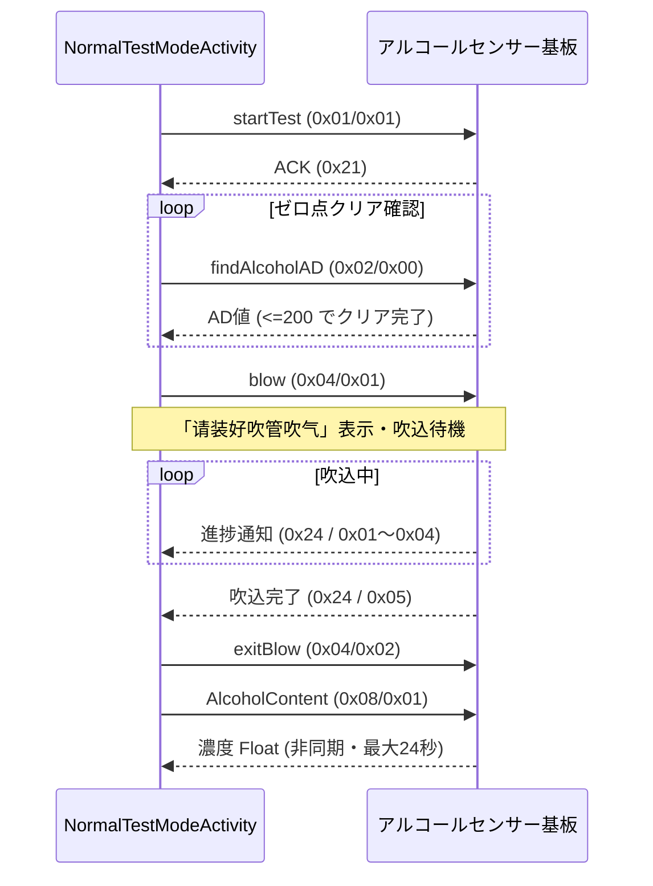

# 測定モードと運用仕様

DS-MDA001 のアルコール測定には、**仕様として存在するモード**、**アプリに実装されているモード**、**コードは残っているが到達できないモード**の 3 層があります。ここを整理しておかないと、プロトコルを叩くときに「コマンドはあるのに何も起きない」で悩むことになります。

---

## 1. 規格が要求する 2 モード

本機は中国国家標準 **GB/T 21254-2017「呼出气体酒精含量检测仪」** に適合する取り締まり用検知器として開発されており、次の 2 モードを備えることが求められています。

| モード | 規格上の記述 | 内容 |
| :--- | :--- | :--- |
| **正常测试**<br/>（通常測定） | 具备正常酒精气体呼出检测功能，插入一次性防倒吸标准吹管 | 使い捨ての逆流防止マウスピースを装着し、規定の呼気量・呼気時間を満たして測定する。証拠能力のある本測定 |
| **快速筛查**<br/>（迅速スクリーニング） | 具备快速筛查功能，不用安装吹管，只需被测人员轻吹一口气就能快速判断是否饮酒 | マウスピース不要。軽く一息吹きかけさせ、飲酒の有無だけを即座に判定する |

検問では全車両を**快速筛查**で流し、反応した相手だけマウスピースを装着して**正常测试**に進む、という運用になります。詳しくは [端末の素性と出自](../identity.md) を参照してください。

---

## 2. アプリに実装されているモード

`com.hikvision.alcoholtest` の起動画面 (`SplashActivity`) が提供するのは次の 3 項目だけです（`res/values/arrays.xml`）。

| メニュー | 遷移先 | 内容 |
| :--- | :--- | :--- |
| 明眸联动模式（連携モード） | `LoginActivity` → `MainActivity` | Hikvision の顔認証端末「明眸 (MinMoe)」と連携し、測定者を紐づける |
| 单机模式（スタンドアロン） | `NormalTestModeActivity` | 端末単体での測定 |
| 记录查询（記録閲覧） | `LogInfoActivity` | ローカル DB の測定記録閲覧 |

**測定を行う Activity は `NormalTestModeActivity` ただ 1 つ**です。AndroidManifest に宣言された Activity も上記 5 つのみで、Quick / Rapid / Screening / Passive といった名前の Activity は存在しません。

### 通常測定シーケンス



アプリが実際に送信するコマンドは **8 種類だけ**です: `startTest` / `findAlcoholAD` / `blow` / `exitBlow` / `AlcoholContent` / `demarcate` / `passiveTest` / `exitTest`。プロトコル上定義されている残りのコマンドは、アプリからは一切発行されません。

各コマンドの詳細は [シリアル通信プロトコル](serial_protocol.md)、実測の非同期挙動は [実測挙動と非同期仕様](measurement_behavior.md) を参照してください。

---

## 3. 到達できないコード {#3}

日本流通版では、取り締まり用の機能がまとめて殺されています。**センサー基板側のファームウェアは対応している可能性が高い**ので、[自作ツール](../tools.md) から直接コマンドを叩けば挙動を確認できます。

### 3.1 快速筛查（迅速スクリーニング） — 完全な Dead Code {#quick-screening}

```java
// OrderTools.java — 3つとも完全に同じフレーム (cmd 0x04 / sub 0x03)
public static String QuickBlow              = "FE020C00020101040309F0FE";
public static String blowQuick              = "FE020C00020101040309F0FE";
public static String quickTestStartAutoPump = "FE020C00020101040309F0FE";
```

| 確認項目 | 結果 |
| :--- | :--- |
| 上記 3 定数を参照しているコード | **APK 全体で 0 箇所** |
| 専用ヘルパークラス `util/RapidScreening.java` | 存在するが**一度も `new` されない**（`OrderTools` に未初期化フィールドがあるだけ） |
| `CmdType.ExitTestForQuick` 列挙定数 | 代入も比較もされない |
| UI 上の導線 | 無し（モードメニューは 3 項目のみ） |
| レイアウト・文字列・画像リソース | quick / rapid / 筛查 の参照は 0 件 |

`blow` が `0x04/0x01`、`exitBlow` が `0x04/0x02` なので、`0x04/0x03` は「吹込モード開始」の第 3 のバリエーションにあたります。

### 3.2 被動測定 `passiveTest` (0x10) — こちらも到達不能 {#passive}

マウスピースなしで周囲の気体を吸って判定するモードです。起動しようとするコードはありますが、条件が永久に成立しません。

```java
// NormalTestModeActivity.java:381 — ExitTestForWarm はどこからも代入されない
if (SampleBoradState == OrderTools.CmdType.ExitTestForWarm) {
    SampleBoradState = OrderTools.CmdType.PassiveTest;
    SerialHelper.sendHex(OrderTools.passiveTest);
```

加えて、起動ボタンであるはずの `btn_passive_test` は `findViewById` されておらず（レイアウト XML にボタン ID が 1 つも存在しない）、参照すれば NPE になります。

ハンドラ側の実装自体は完成しており、レスポンス仕様は以下の通りです。

| 条件 | 意味 |
| :--- | :--- |
| `mRecvBuf[7] == 0x22` | NAK。1回リトライ後「失败请重新点击被动」 |
| `mRecvBuf[7] == 0x23`, `mRecvBuf[8] == 0` | 「正在气体分析」＝分析中（暫定応答） |
| `mRecvBuf[7] == 0x23`, `mRecvBuf[8] ∈ {1,2,3}` | 確定値。bytes 9-12 が Float 濃度 |
| その他 | 「气体收集失败,请重试」→ `exitTest` |

`TestType` は `"被动测试"` としてタグ付けされます。**快速筛查 (`0x04/0x03`) とは別コマンド**である点に注意してください。

### 3.3 工場出荷校正モード

`FactoryTestFlag` という Intent Extra を見て校正フロー (`demarcate` 送信など) に入るコードがありますが、**この Extra を put している箇所が存在しません**。

---

## 4. 判定ロジックと単位 {#4}

### 4.1 単位は mg/L 固定

```java
// Constant.java
g_100mL  = "g/100mL(BAC)"
mg_100mL = "mg/100mL(BAC)"
mg_L     = "mg/L(BrAC)"      // ← これが使われる
mg_mL    = "mg/mL(BAC)"
ug_100mL = "ug/100ml(BrAC)"
```

`NormalTestModeActivity` で `this.unit = Constant.mg_L;` とハードコードされており、切り替える UI はありません。センサーが返す Float 値はそのまま **mg/L (呼気中アルコール濃度, BrAC)** です。

変換は `Utils.formatDensityString()` が担当し、血中濃度への換算比は **220**（2200:1 の分配係数相当）です。

| 単位指定 | 処理 |
| :--- | :--- |
| `mg/L(BrAC)` | **生値をそのまま** `0.000` 書式で返す |
| `mg/100mL(BAC)` | `値 × 220`。ただし **4.0 未満は 0 に丸められる** |

### 4.2 中国式の 20 / 80 判定は動作していない

```java
// NormalTestModeActivity.java:655-691
float f2 = Float.parseFloat(Utils.formatDensityString(Constant.mg_L, fBytesToFloat2));
if (f2 < 20.0f)                        → 未超标        (緑 #006400)
else if (f2 >= 20.0f && f2 < 80.0f)    → 饮酒后驾车    (黄 #DAA520)
else if (f2 >= 80.0f)                  → 醉酒后驾车    (赤)
```

!!! bug "単位を換算せずに閾値と比較している"
    `f2` は `mg_L` 指定で生成されるため **mg/L の生値**です。一方 20 / 80 は GB 19522 が定める **mg/100mL (BAC)** の数値です。
    実際の呼気濃度は 0.15 mg/L といったオーダーなので、`f2` が 20 を超えることは現実的にありません。**この判定は常に「未超标」に落ちます。**

    同じ計算をしているアラートリングの描画 (`UpdateAlcoholColorRing`) も常に `< 5.0` の分岐に入り、ゲージが動きません。

    皮肉なことに、この不具合が**別のクラッシュを防いでいます**。20〜80 および 80 以上の分岐の中では `btn_continue` / `btn_exit` などの未バインドな Button フィールドを参照しており、到達すれば NPE になります。

### 4.3 実際に効いている判定は 0.15 mg/L

```java
// NormalTestModeActivity.java:711-726  (スタンドアロンモード時)
if (d >= 0.15d)                    → "NG"
else if (0.0f <= f3 && d < 0.15d)  → "OK"
```

これは日本の道路交通法の呼気アルコール基準（0.15 mg/L）です。中国向け本体に日本向け判定を後付けしたビルドであることが、ここからも分かります。

!!! bug "レシート印字の境界値が DB と食い違う"
    | 実装 | 条件 | 0.15 ちょうどのとき |
    | :--- | :--- | :--- |
    | `PrintUtil.print()` | `d > 0.15` で NG / `d <= 0.15` で OK | **OK** |
    | `PrintUtil.printAll()` / DB 記録 | `d >= 0.15` で NG / `d < 0.15` で OK | **NG** |

    ちょうど 0.15 mg/L のとき、画面・DB と一部の印字で判定が逆転します。

### 4.4 その他の定数

| 定数 | 値 | 意味 |
| :--- | :--- | :--- |
| `Constant.ADC_THRESHOLD_VALUE` | `200` | ゼロ点クリア完了とみなす AD 値の上限 |
| `blowTime` | `3.0f` | 吹込の規定秒数 |

---

## 5. 結局どのモードが使えるのか

| モード | 公式アプリ | プロトコル直叩き |
| :--- | :---: | :---: |
| 正常测试（マウスピース有り本測定） | ✅ | ✅ |
| 快速筛查（スクリーニング） | ❌ Dead Code | ⚠️ 未検証（`0x04/0x03` を送れば試せる） |
| 被动测试（受動吸引測定） | ❌ 到達不能 | ✅ 動作確認済み（[実測挙動](measurement_behavior.md) 参照） |
| 工場校正 (`demarcate`) | ❌ 到達不能 | ✅ 応答取得済み（[プロトコル §5.3](serial_protocol.md)） |

[AlcoholTestDebugger](../tools.md) の TCP ブリッジを使えば、PC から任意のフレームを投げて 3 行目以降を自分で確かめられます。
