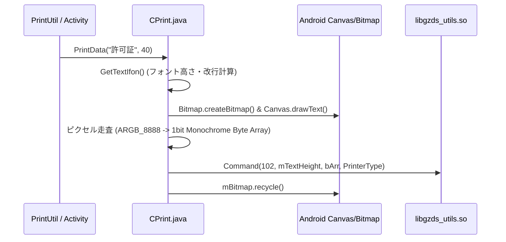

# プリンター制御仕様書 (Printer Control Documentation)

本ドキュメントでは、Hikvision製アルコール検知端末 (`com.hikvision.alcoholtest`) に組み込まれているサーマルプリンター制御のアーキテクチャ、JNI/Nativeコマンド仕様、印字フロー、および制御コードについて解説します。

---

## 1. システムアーキテクチャ

プリンター制御システムは、上位アプリケーション層からNative (C/C++) ライブラリ、シリアル通信ドライバ層までの多層構造で構成されています。

```mermaid
graph TD
    A["Hikvision Activity<br/>(NormalTestModeActivity)"] -->|PrintUtil.printAll()| B["PrintUtil<br/>(com.hikvision.alcoholtest.util)"]
    B -->|High-Level API| C["Printer / CPrint<br/>(com.gzds.utils)"]
    C -->|JNI Command Call| D["libgzds_utils.so<br/>(Native Command & Protocol)"]
    C -->|Serial Port I/O| E["CSerialPort<br/>(com.gzds.utils)"]
    D & E -->|Character Device / SPI| F["内蔵サーマルプリンターハードウェア<br/>(/dev/prn-dev)"]
```

### 主なモジュールと構成ファイル

| モジュール名 | パッケージ / パス | 役割・概要 |
| :--- | :--- | :--- |
| **PrintUtil** | [PrintUtil.java](../../apks/decompiled/com.hikvision.alcoholtest/sources/com/hikvision/alcoholtest/util/PrintUtil.java) | アルコール測定結果（許可証）や顔写真画像の非同期印刷タスク生成 |
| **Printer** | [Printer.java](../../apks/decompiled/com.hikvision.alcoholtest/sources/com/gzds/utils/Printer.java) | `CPrint` のラッパークラス。Boolean型戻り値への変換インターフェース |
| **CPrint** | [CPrint.java](../../apks/decompiled/com.hikvision.alcoholtest/sources/com/gzds/utils/CPrint.java) | テキストのBitmap描画、モノクロ化・ビットパック、JNI Nativeメソッド呼出 |
| **CSerialPort** | [CSerialPort.java](../../apks/decompiled/com.hikvision.alcoholtest/sources/com/gzds/utils/CSerialPort.java) | Nativeシリアルポートオープン（`su`によるパーミッション昇格含む） |
| **libgzds_utils.so** | Native Library (`System.loadLibrary("gzds_utils")`) | プリンター制御コマンドパケット生成およびシリアル送信を行うC/C++共有ライブラリ |

---

## 2. JNI Interface & Native コマンド仕様

`CPrint` クラスでは、JNIを通じて `libgzds_utils.so` 内の `Command` 関数を呼び出し、プリンターに対して各種制御コマンドを発行します。

```java
private static native int Command(int cmd, int param1, byte[] data, int printerType);
private static native void Close();
```

### コマンドコード（Opcode）一覧

| Opcode (10進) | Hex | 定数名 (CPrint) | パラメータ / データ | 機能説明 |
| :---: | :---: | :--- | :--- | :--- |
| **68** | `0x44` | `PRINTER_STATUS` | - | プリンターのステータス取得 (0=待機, 1=印刷中(BUSY)。紙の有無では変化しない) |
| **85** | `0x55` | `PRINTER_PRINTER_FEED` | `param1`: 送り量<br/>`data`: `bufferMove` | 紙送り（正方向）。`speed(byte[])` 関数でも使用 |
| **102** | `0x66` | `PRINTER_TASK` | `param1`: 高さ (px)<br/>`data`: ビットマップバイト列 | 1bitモノクログラフィックデータ（テキスト描画結果含む）の印刷 |
| **103** | `0x67` | - | `param1`: 120<br/>`data`: 16階調グレースケールバイト | 顔写真等の画像データ印刷 (`sendPrintPictureData`) |
| **119** | `0x77` | `PRINTER_PAPERCHECK` | `data`: `{20}` | 用紙有無チェック (`PrintCheckPaper`) |
| **136** | `0x88` | `PRINTER_DARKNESS` | `data`: `{darkness}` (1～20) | 印字濃度（ダークネス）の設定 (`PrinterSetDarkness`) |
| **153** | `0x99` | `PRINTER_BACKWARD` | `param1`: 逆送り量 | 用紙の逆送り（バックフィード） |

---

## 3. テキスト描画・ラスタライズ制御フロー

サーマルプリンターへのテキスト印刷は、文字コード直接送信ではなく、Androidの `Canvas` を使用してメモリ上でビットマップ画像に描画・ラスタライズしてからプリンターへ送出する方式が採用されています。



### 1-bit モノクロ化・ビットパックアルゴリズム
`CPrint.PrintText()` 内で、描画された `ARGB_8888` ビットマップの全ピクセルを走査し、白以外のピクセル（`pixel != -1`）を黒ドット（ビット `1`）として1バイトに8ピクセル分パックします。

```java
int i2 = 7;
byte b = 0;
int i3 = 0;
for (int i4 = 0; i4 < mTextHeight; i4++) {
    for (int i5 = 0; i5 < mTextWidth; i5++) {
        if (mBitmap.getPixel(i5, i4) != -1) {
            b = (byte) (b | (1 << i2)); // 黒ドットのビットを立てる
        }
        i2--;
        if (i2 < 0) {
            bArr[i3] = b;
            i3++;
            i2 = 7;
            b = 0;
        }
    }
}
```

---

## 4. レシート（許可証・測定結果）印字フォーマット

`PrintUtil.printAll()` によって出力されるアルコール測定結果レシートのフォーマット構成です。

### 印字レイアウト構成

```text
+------------------------------------------+
|             許可証                      | <- タイトル (40pt)
|               スタンドアロンモード       | <- 動作モード (30pt, 条件指定時)
| [顔写真 16階調グレースケール画像 240x120]  | <- 写真データ (i == 1 の場合)
| ID：12345                                | <- ユーザーID
| 氏名：山田 太郎                          | <- 氏名
| 時間：2026-08-06 20:00:00                | <- 測定日時
| 車両出帰状態：出庫                      | <- 車両ステータス
| 車両番号：品川 500 あ 12-34               | <- ナンバープレート
| アルコール濃度:0.00mg/L                  | <- 測定濃度
| 温度：36.5℃                             | <- 体温/センサー温度
| 判定：OK                                 | <- 判定結果 (OK: <0.15, NG: >=0.15)
|                                          |
|                                          | <- 紙送り 3行 (PrintLineFeed(3))
+------------------------------------------+
```

### 判定条件ロジック
- **アルコール濃度 threshold**: `0.15 mg/L`
  - `濃度 < 0.15 mg/L` $\rightarrow$ **判定：OK**
  - `濃度 >= 0.15 mg/L` $\rightarrow$ **判定：NG**

---

## 5. ハードウェア・デバイスノード仕様

- **プリンター専用デバイスノード**: `/dev/prn-dev` (Native `libgzds_utils.so` 内で `ioctl` 制御)
- **汎用シリアルポートデバイス**: `/dev/ttyMSM1` (アルコールセンサーモジュール等で使用されるUARTポート)
- **パーミッション自動昇格**:
  シリアルデバイスやプリンターノードのアクセス権限がない場合、`CSerialPort` コンストラクタ内部で `/system/bin/su` を実行し、自動的に `chmod 777` を発行してパーミッションを獲得します。

```java
if (!file.canRead() || !file.canWrite()) {
    Process processExec = Runtime.getRuntime().exec("/system/bin/su");
    processExec.getOutputStream().write(("chmod 777 " + file.getAbsolutePath() + "\nexit\n").getBytes());
    processExec.waitFor();
}
```

---

## 6. API リファレンス概要 (`com.gzds.utils.Printer`)

外部モジュールから利用可能な主要メソッド：

| メソッド | 引数 | 戻り値 | 説明 |
| :--- | :--- | :--- | :--- |
| `PrinterInit(int type)` | `int type` | `int` | プリンタータイプ初期化 (通常 `1`) |
| `PrinterSetDarkness(byte darkness)` | `byte` (1-20) | `Boolean` | 印字濃度設定 |
| `PrinterSetFont(Typeface font)` | `Typeface` | `Boolean` | 使用フォントスタイルの指定 |
| `PrinterSetFontZoom(float scale)` | `float` | `Boolean` | フォント横方向倍率の指定 (`mZoomWidth`) |
| `PrintData(String text, int size)` | `String`, `int` | `Boolean` | テキスト文字列の印刷 |
| `PrintLineFeed(int lines)` | `int` | `Boolean` | 指定行数の紙送り（負数の場合はバックフィード） |
| `PrintCheckPaper()` | なし | `Boolean` | 用紙の有無状態チェック |
| `PrinterClose()` | なし | `Boolean` | プリンターリソースの解放および終了 |
